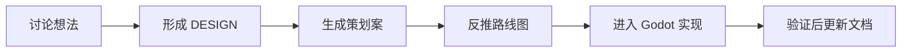
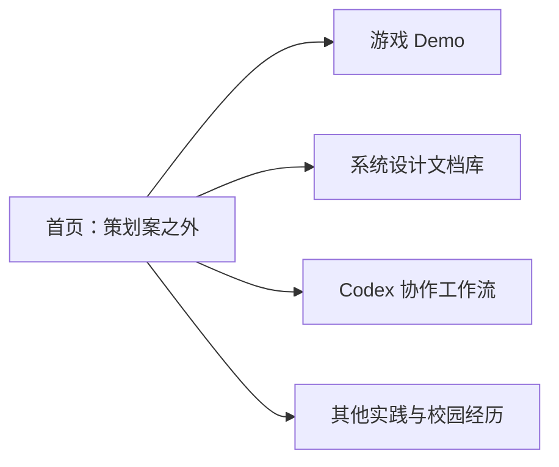
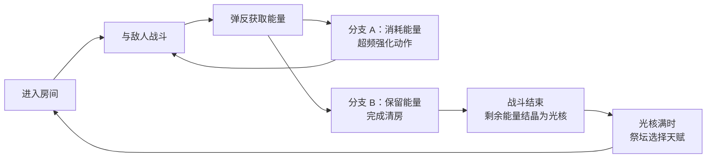

# 作品集网页_执行方案

> 网页名称：策划案之外
> 定位：用《Reforge》游戏 Demo 展示游戏策划实习候选人的能力，同时展示系统设计文档库、Codex 协作工作流和其他实践经历。

## 1. 网页定位

这是一个以游戏 Demo 为核心证据的个人作品集网页。

网页首先让面试官看到《Reforge》是一个具备 P0 Core Loop 的游戏原型；然后通过 Obsidian 文档体系展示系统设计、策划案、世界观和开发路线图；再通过 Codex 协作工作流展示我如何把讨论、设计、文档和工程实现连接起来；最后用其他实践与校园经历补充展示学习能力、表达能力和项目推进能力。

网页服务游戏策划实习求职。页面内容以真实项目、可验证 Demo、系统文档和工作流证据为主。

## 2. 核心目标

### 2.1 展示游戏 Demo

《Reforge》是网页的主项目。首页和游戏 Demo 页面需要优先展示：

- 游戏画面或演示视频。
- P0 Core Loop。
- 当前原型状态。
- 已完成的核心系统。
- GitHub / Demo 入口。


### 2.2 展示系统设计文档库

系统设计文档库用于展示 Reforge 的 Obsidian 双链文档体系。

重点展示：

- [[DESIGN_核心系统设计文档]]
- [[DESIGN_玩家行为系统]]
- [[DESIGN_能量系统]]
- [[DESIGN_天赋系统]]
- [[DESIGN_敌人系统]]
- [[DESIGN_世界观设计文档]]
- [[INDEX_开发路线图]]
- [[策划案_玩家行为系统]]
- [[策划案_能量系统]]
- [[策划案_锈犬]]
- [[策划案_光核与祭坛]]

文档体系需要体现：

- `DESIGN_` 负责稳定机制和系统边界。
- `策划案_` 负责实现范围、数值、状态、信号、程序需求和验收标准。
- `INDEX_开发路线图` 负责整体项目规划、阶段目标、任务拆分和完成状态。
- `ART_` 负责美术方向与资产规格。
- Obsidian 双链把机制、世界观、策划案、路线图和美术需求串联成项目知识库。

### 2.3 展示 Codex 协作工作流

Codex 协作工作流用于展示我如何借助 AI 推进游戏生产流程。

重点展示：

- 创建 Reforge 专用 Skill。
- 将对话分为主策、系统策划、研发、美术等窗口。
- 主策窗口负责总体方向、优先级和文档总控。
- 系统策划窗口负责能量、超频、天赋、怪物、Boss、数值、Core Loop 和构筑体验。
- 研发窗口负责 Godot 实现、测试、Debug、代码解释和开发日志。
- 美术窗口负责美术方向、资产规格、Prompt、原型表现和资源接入。

工作流链路：



### 2.4 补充其他实践与校园经历

其他实践与校园经历作为加分项，补充展示学习能力、表达能力、组织能力和持续实践能力。

内容包括：

- vibe coding 项目。
- 游戏拆解。
- 奖项照片。
- 班长、支部书记经历。
- 主持会议照片。

## 3. 技术底座

站点拆成两层，避免在 Quartz 主题定制上消耗大量精力：

- **静态首页**：根路径，纯 HTML / CSS / JS，不依赖框架。承担开场动画、红黑白品牌视觉、自我介绍、能力体现、四个板块入口和 P0 Core Loop 简图。
- **Quartz 文档站**：挂在 `/docs` 子路径，保持接近原生主题，只做配色和字体微调。

Quartz 承担：

- Markdown 发布。
- Obsidian `[[双链]]`。
- Backlinks。
- Mermaid。
- 搜索。
- Explorer。
- 交互式 Graph View（Quartz 4 自带，无需静态截图降级方案）。

静态首页承担：

- “策划案之外”的红黑白视觉。
- 首页开场动画。
- 首页排版。
- 四个板块的展示顺序。
- 游戏 Demo、文档、工作流和经历内容的入口设计。

## 4. 视觉风格

### 4.1 主题风格

网页采用红黑白三色、衬线字体和剪影感视觉。

参考方向为《喜鹊谋杀案》开头 OP 的红黑白剪影气质。网页只借鉴抽象风格，包括三色关系、硬边图形、纸面推理感和标题归位动画。

### 4.2 色彩

红黑白主题色、剪影风格

### 4.3 字体

已确定字体组合（均免费可商用）：

| 角色 | 字体 | 来源 / 加载 |
|------|------|------|
| 中文标题 | 京華老宋体（KingHwa_OldSong） | 中文网字计划 unpkg CDN，分片按需加载；上线前对标题用字做子集化 |
| 中文正文 | 思源宋体（Noto Serif SC） | Google Fonts，400 / 700 / 900 |
| 英文 / 数字 | Fraunces | Google Fonts，可变字体；大标题 900，小字 400 + `tnum` 表格数字 |
| 代码 / 标签 | JetBrains Mono | Google Fonts |

搭配逻辑：京華老宋体复刻民国铅字，横细竖粗对比强，负责"案卷标题"的庄重和锋利；思源宋体负责正文可读性；Fraunces 带轻微手工感的暖度，补京華缺的纸面温度，且全字重 + Italic + 表格数字能覆盖 kicker、日期、编号全部配角场合。点缀备选：Instrument Serif Italic（板块页斜体英文引言），MVP 不需要。

候选对比样张存档：`fonts.html`（英文 7 候选）、`fonts_cn.html`（中文标题 4 候选，含 Hero / 开场动画 / 品牌位三状态对比）。

### 4.4 开场动画

已确定方案：**盖印式**。利用“策划案之外”五个字本身的语义做戏，整体气质是铅字盖印，呼应京華老宋体的民国铅字出身。

分镜（总时长约 2.5 秒）：

| 时间 | 内容 |
|------|------|
| 0.0s | 黑场 |
| 0.0–0.5s | 「策划案」三个白色衬线字逐字盖印落下（每字 scale 1.2→1 + 瞬间定格，间隔约 140ms，像铅字砸在纸上） |
| 0.5–0.9s | 「之外」两个红字以更重的节奏盖下，落下瞬间整屏轻震 2px |
| 0.9–1.4s | 停留（让人看清标题） |
| 1.4–2.1s | 标题缩小平移到左上角品牌位（FLIP 计算落点） |
| 1.55–2.45s | 黑幕以一条斜线 clip-path 向上掀开（比归位晚 0.15s 启动，先看到标题动、再看到幕掀） |
| ~2.5s | 移交完成，真实品牌位接管 |

设计要点：

- 颜色分配：「策划案」白、「之外」红——视觉重音落在网页立意上。标题归位后这个红白关系永久保留在品牌位，开场动画和常驻 UI 是同一套设计语言。
- 全程不用 opacity 渐变做主要转场，用 clip-path 硬边擦除和位移，保持剪影 / 纸面的硬边气质。
- 可选点缀：「之外」红字加 `mix-blend-mode: multiply` 模拟铅印套色叠印感。

技术实现：纯 CSS keyframes + 少量 JS（落点计算、跳过逻辑），不引入动画库。

跳过与可访问性：

- 点击 / 滚动 / Esc 直接跳到结束态。
- `prefers-reduced-motion` 用户直接无动画。
- sessionStorage 控制每次会话只播一次（`?replay` 参数强制重播）。

升级备选（非 MVP）：**剪影横掠式**——红底上黑色剪影（骑士 / 喜鹊）从右向左掠过，掠过轨迹用 mask 擦出标题，更接近《喜鹊谋杀案》OP 原版。需要先用 AI 生图管线产出高质量剪影并矢量化，时长可能放宽到 2s+。盖印式的归位、揭幕、跳过代码可全部复用，剪影段只是加在前面。

## 5. 页面结构

网站采用四个板块：



导航为：

- 游戏 Demo
- 系统设计文档库
- Codex 协作工作流
- 其他实践与校园经历

## 6. 首页内容

首页负责总览，不展开所有细节。首页要让面试官快速理解：这是一个游戏策划作品集，主项目是《Reforge》，网页通过 Demo、文档、AI 协作和经历展示能力。

首页内容顺序：

1. 开场动画。
2. 自我介绍。
3. 《Reforge》概念图
4. 能力体现。
5. 四个板块介绍。
6. P0 Core Loop 简图。

### 6.1 自我介绍

首页正文：

```md
欢迎来到我的个人网页，感谢您的浏览。

我正在寻找游戏策划实习机会。这个网页记录了我从 0 到 1 独立开发游戏《Reforge》的过程，也整理了我在 AI 协作、系统设计、文档管理和项目推进中的一些实践。除了 Reforge，这里也收录一些 vibe coding 小项目、玩法想法、游戏拆解和个人经历。

《Reforge》是一款 2D 俯视角动作 Roguelike。目前项目已经确定核心机制，完成了 P0 Core Loop，并围绕游戏机制建立了对应的设计文档、策划案和开发路线图。
```
z

打算在自我介绍旁边放一个概念图


能力体现承接在自我介绍和 Reforge 介绍下面。

```md
希望能够展现三种能力：

1. **验证玩法的能力**
   对一名合格的游戏策划而言，重要的不只是提出玩法想法，还要能把想法通过引擎做成可以验证、可以体验、可以调整的原型。《Reforge》使用 Godot 引擎开发，目前已经验证了核心循环和核心玩法。

2. **用 Obsidian 建立系统性文档的能力**
   我使用 Obsidian 将策划、研发和美术串联起来，这也是我理解中策划需要承担的连接工作。`DESIGN_` 记录核心系统规则，`策划案_` 记录实现范围和验收标准，`INDEX_开发路线图` 记录任务拆分和进度，`ART_` 记录美术方向与资产规格。双链让这些内容形成互相引用的项目知识库，构成一套系统性文档。

3. **与 AI 协作建立工作流的能力**
   我通过 Codex 建立了一套游戏生产流程：创建 Reforge 专用 Skill，拆分主策、系统策划、研发、美术等对话窗口。主策窗口把控总体方向和核心机制，系统策划窗口将设计文档转化为可执行策划案，研发窗口按照策划案推进 Godot 实现，美术窗口整理资产规格和美术需求。讨论、设计、文档和工程实现由此形成连续流程。
```


板块介绍只写入口说明。

```md
## 游戏 Demo
这里展示《Reforge》的 P0 Core Loop、核心玩法、游戏演示、当前原型状态和 Demo 入口。

## 系统设计文档库
这里展示 Reforge 的 Obsidian 双链文档体系，包括核心设计、世界观、策划案和开发路线图。

## Codex 协作工作流
这里展示我如何通过 Codex、专用 Skill，以及主策、系统策划、研发、美术多窗口分工，建立游戏开发工作流。

## 其他实践与校园经历
这里记录我的 vibe coding 项目、游戏拆解，以及学生生涯中的奖项、学生工作和活动经历。
```

### 6.5 P0 Core Loop 简图

首页需要展示一条简洁的 Core Loop。



## 7. 四个板块

### 7.1 游戏 Demo

介绍：
这里展示了《Reforge》的游戏原型和 P0 Core Loop。

《Reforge》是一款 2D 俯视角动作 Roguelike，核心参考为《只狼》的前期弹反手感、《杀戮尖塔》的构筑深度，以及《哈迪斯》的房间推进结构与俯视角动作读感。目前 P0 已经跑通核心循环：玩家进入房间，与敌人战斗，通过弹反获取能量；获得能量后产生资源决策分支，玩家可以消耗能量触发超频，强化普攻、闪避或弹反，也可以保留能量完成清房；清房后将剩余能量结晶为光核进度；攒满光核后，在祭坛触发三选一天赋，让本局构筑继续推进。

这个模块重点展示游戏演示、P0 Core Loop、当前原型状态和 GitHub / Demo 入口。


内容：

- 游戏视频 / GIF / 截图。
- Demo 入口或下载入口。
- GitHub 链接。
- P0 Core Loop 图。
- 当前原型状态。
- 已完成核心系统：
  - 玩家行为：普攻、闪避、弹反、受击。
  - 能量与超频。
  - 锈犬敌人。
  - 光核结晶与祭坛。
  - 天赋三选一入口。

页面重点：

- 玩家在游戏里做什么。
- 一间房如何完成。
- 能量和光核如何进入循环。
- P0 原型已经完成到什么程度。

### 7.2 系统设计文档库

介绍：
这里展示了 Reforge 的 Obsidian 双链文档体系。

`DESIGN_核心系统设计文档` 是核心机制总纲，用来说明游戏的整体方向、核心循环和主要系统关系。每个具体机制都有对应的 `DESIGN_` 文档，记录稳定规则和系统边界。`策划案_` 文档负责执行层内容，包括实现范围、数值、状态、信号、程序需求和验收标准。`INDEX_开发路线图` 负责整体项目规划，记录每个阶段的目标、任务拆分、优先级和完成状态，并链接到对应的策划案和系统文档。

双链让这些内容形成互相引用的项目知识库，也让设计、研发、美术和进度管理连接成一个可追踪的工作体系。


内容：

- Obsidian / Quartz 文档入口。
- 文档图谱或图谱截图。
- DESIGN 文档。
- 策划案文档。
- DATA 文档。
- ART 文档。
- INDEX_开发路线图。
- 双链和 Backlinks。

页面重点：

- 核心系统设计文档是机制总纲。
- 具体系统有对应 DESIGN 文档。
- 策划案记录执行范围和验收标准。
- 路线图记录整体项目规划、任务拆分和完成状态。
- 双链把机制、世界观、实现、资产和进度连接起来。

### 7.3 Codex 协作工作流

介绍：
这里展示了我如何通过 Codex 建立游戏开发工作流。

我为 Reforge 创建了专用 Skill，并将对话分为主策、系统策划、研发、美术等窗口。主策窗口负责总体方向、核心机制和优先级把控；系统策划窗口负责将设计文档转化为可执行的策划案；研发窗口根据策划案推进 Godot 实现、测试和问题修正；美术窗口整理美术方向、资产规格和原型表现需求。讨论、设计、文档和工程实现通过 Obsidian 与 Godot 形成连续流程。


内容：

- Reforge 专用 Skill。
- 多窗口分工。
- 设计到策划案的转化。
- 策划案到路线图的转化。
- 路线图到 Godot 实现的转化。
- 实现后回写文档。

页面重点：

- Codex 是协作工具。
- 我负责方向、优先级、范围和最终取舍。
- Skill 和多窗口让 AI 协作变成可复用流程。
- Obsidian 负责承接结论，Godot 负责验证玩法。

### [[7.4 其他实践与校园经历]]

这里记录了我的 vibe coding 项目、游戏拆解，以及学生生涯中获得的奖项、学生工作和活动经历。这些内容用于补充展示我的想法验证、学习能力、组织表达和项目推进能力。

内容：

- vibe coding 项目。
- Dead Cells / Sekiro 游戏拆解。
- 奖项照片。
- 班长、支部书记经历。
- 主持会议照片。

页面重点：

- 加分项服务个人能力补充。
- 首页只展示少量精选内容。
- 完整内容放入对应板块页面。

## 8. 内容资产清单

### 8.1 必备资产

- Reforge 视频 / GIF / 截图（以 2D 版 P0 为准）。
- GitHub 链接。
- Demo 入口（形式暂定：倾向 Godot Web 导出 + itch.io 浏览器可玩，备选下载包）。
- Quartz 可公开文档清单。
- Obsidian 图谱截图或 Graph 插件方案。
- Reforge 专用 Skill 展示材料。
- Codex 多窗口分工说明。
- 简历 PDF。

### 8.2 加分资产

- vibe coding 项目截图。
- Dead Cells / Sekiro 拆解摘要。
- 奖项照片。
- 班长 / 支部书记 / 主持会议照片。
- Godot 测试场景短 GIF。

## 9. MVP 范围

MVP 必须完成：

- 首页开场动画。
- 首页自我介绍。
- 首页 Reforge Demo 预览位。
- 首页能力体现。
- 首页四个板块介绍。
- 首页 P0 Core Loop 简图。
- 游戏 Demo 板块。
- 系统设计文档库板块。
- Codex 协作工作流板块。
- 其他实践与校园经历板块。
- Quartz 基础站点能本地构建。
- Obsidian 双链、Backlinks、Mermaid 能正常显示。

MVP 可暂缓：

- 完整交互式 Graph 插件。
- 所有文档全文公开。
- 多语言。
- 复杂滚动叙事。
- 大量照片墙。
- 复杂角色动画或大型 Canvas。

## 10. 实现阶段

### Phase 1：首页静态原型

- 实现“策划案之外”开场动画。
- 实现首页自我介绍。
- 放置 Reforge Demo 预览位。
- 展示三种能力。
- 展示四个板块介绍。
- 展示 P0 Core Loop 简图。

完成标准：

- 首页清楚表达网页定位。
- 面试官第一屏能看到 Reforge Demo 相关信息。
- 能力展示承接在自我介绍之后。
- 四个板块入口清楚。

### Phase 2：Quartz 初始化

- 创建 Quartz 站点。
- 配置站点标题为“策划案之外”。
- 导入公开文档。
- 验证 `[[双链]]`、Backlinks、Mermaid、搜索。
- 验证自带的交互式 Graph View。
- 确认挂载到静态首页 `/docs` 子路径的部署方式。

完成标准：

- Quartz 本地可预览。
- 核心文档可访问。
- 双链和 Backlinks 可用。

### Phase 3：四个板块页面

- 游戏 Demo 页面。
- 系统设计文档库页面。
- Codex 协作工作流页面。
- 其他实践与校园经历页面。

完成标准：

- 每个页面只服务一个目标。
- 页面可从首页快速抵达。
- 内容能在 1 分钟内被理解。

### Phase 4：投递前打磨

- 检查移动端。
- 压缩图片和视频。
- 检查错别字。
- 检查所有链接。
- 检查公开文档范围。
- 部署站点。

## 11. 验收标准

- 面试官能理解网页围绕游戏 Demo、系统设计文档库、Codex 协作工作流和其他实践经历展开。
- 首页包含自我介绍、能力体现、四个板块介绍和 P0 Core Loop。
- 首页有“策划案之外”文字开场动画。
- 页面使用红黑白主题色和衬线字体。
- 导航为中文，字号清晰。
- Quartz 能正常构建。
- Obsidian `[[双链]]`、Backlinks、Mermaid 能正常显示。
- 系统设计文档库能展示 DESIGN、策划案、路线图之间的关系。
- Codex 协作工作流能展示 Skill、多窗口分工和文档落地链路。
- 其他实践与校园经历不会抢占游戏 Demo 和系统设计主线。

## 12. 当前待办

- [x] 确定网页名称：策划案之外。
- [x] 确定定位：用 Reforge 游戏 Demo 展示能力（以 2D 版 P0 为准）。
- [x] 确定技术底座：静态首页 + Quartz 挂 `/docs` 子路径。
- [x] 确定视觉方向：红黑白、衬线体、开场动画。
- [x] 确定开场动画方案：盖印式（详见 4.4）。
- [x] 确定字体组合：京華老宋体 / 思源宋体 / Fraunces / JetBrains Mono（详见 4.3）。
- [x] 确定四个板块：游戏 Demo / 系统设计文档库 / Codex 协作工作流 / 其他实践与校园经历。
- [ ] 重做首页静态原型（旧 concept.html 作废，从零重做，注意清空全部占位虚构内容）。
- [ ] 确定 Demo 入口形式（暂定浏览器可玩）。
- [ ] 整理 Reforge Demo 视频 / GIF / 截图。
- [ ] 确定可公开发布的 Obsidian 文档范围。
- [ ] 创建 Quartz 站点并跑通本地预览。
- [ ] 整理 Reforge 专用 Skill 与多窗口分工展示材料。
- [ ] 整理加分项照片与说明。
