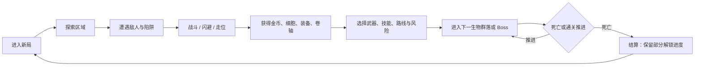
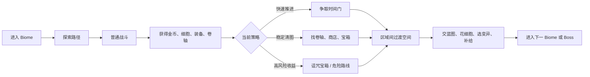
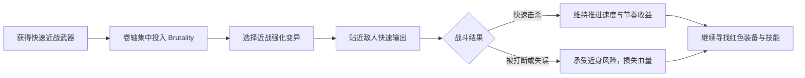
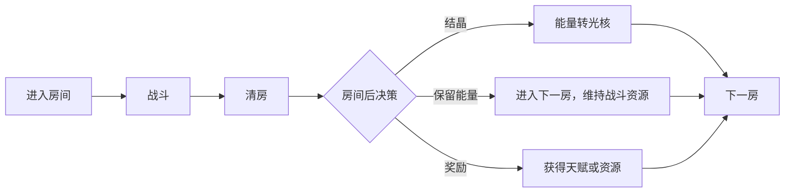

# 拆解_Dead Cells

## 1. 拆解目标

本文分析《Dead Cells》如何通过房间推进、临时构筑、风险收益和死亡重开，让玩家在高失败率下保持下一局动力。

本文重点关注：

- Core Loop 如何驱动重复游玩。
- 房间节奏如何制造短周期决策。
- 构筑体验如何在一局内快速成形。
- 哪些结构可转化为 Reforge 的设计参考。

## 2. Core Loop

核心循环由两层成长共同支撑：

- 局内成长：装备、卷轴、金币、药水次数、路线选择，决定这一局的战斗强度和生存空间。
- 局外成长：细胞、蓝图、永久解锁，降低死亡后的挫败感，并扩展后续局内选择池。

玩家愿意重开的关键在于：死亡会终止当前构筑，但不会抹掉所有学习、解锁和路线经验。

## 3. 房间节奏拆解

《Dead Cells》的区域节奏同时提供四类推进欲望：

- 速度欲望：时间门奖励快速推进，让玩家考虑少探索、快通关。
- 完整探索欲望：卷轴、装备、商店、宝箱鼓励玩家把区域资源吃干净。
- 技术证明欲望：连杀门、无伤门奖励稳定战斗表现。
- 风险收益欲望：诅咒宝箱和危险路线鼓励玩家主动承受更高死亡风险。

这些欲望把一次区域推进拆成连续判断：

- 当前装备是否足够支撑下一段？
- 这张图还值得继续搜吗？
- 现在保血更重要，还是拿奖励更重要？
- 为了时间门放弃部分探索是否划算？

## 4. 构筑体验拆解

### 4.1 构筑从颜色开始

《Dead Cells》的构筑基础是 Brutality、Tactics、Survival 三种属性颜色。玩家通过卷轴提高属性，武器、技能和部分变异会按对应颜色获得收益。

- Brutality 倾向近战、快速攻击、进攻压力。
- Tactics 倾向远程、陷阱、炮台、技能输出。
- Survival 倾向盾、重武器、控制、耐久和防守反击。

颜色系统的价值在于快速收束选择。玩家在早期拿到主力武器后，会自然倾向把卷轴和后续装备往同一方向集中。

### 4.2 构筑由临时获得驱动

玩家无法稳定复刻上一局的完整装备组合。武器、技能、商店、宝箱、掉落和蓝图池共同制造变化。每一局的构筑都带有适应性：

- 拿到什么武器，决定短期战斗手感。
- 拿到什么技能，决定输出节奏和安全距离。
- 卷轴投入方向，决定是否继续强化当前打法。
- 变异选择，决定这一局的战斗补强方式。

因此，构筑体验发生在不断前进的路上。玩家每次换装备，都会重新评估“这局现在像什么打法”。

### 4.3 构筑选择有明确成本

构筑选择的压力来自有限槽位和单局机会成本：

- 武器槽限制玩家保留的主动攻击手段。
- 技能槽限制爆发、控制、位移、召唤等辅助能力。
- 变异选择限制被动补强方向。
- 卷轴投入会放大某一颜色，同时让其他颜色装备的吸引力下降。

这种结构让每次选择都带有放弃成本。玩家需要判断当前构筑是否值得继续投资，避免只比较数值强弱。

### 4.4 构筑成形速度很快

《Dead Cells》不会等到后期才让玩家感到构筑差异。早期武器、技能和卷轴已经能让本局打法变得清晰。玩家能很快感受到：

- 这一局偏贴身快攻。
- 这一局偏远程消耗。
- 这一局偏盾反和重击。
- 这一局偏炮台、陷阱和控场。

快速成形的好处是降低重开疲劳。玩家死亡后重新开始，很快就能遇到新的打法苗头。

### 4.5 构筑案例：红色近战快攻流

红色近战快攻流以 Brutality 属性为主，围绕快速近战武器、近身压制、短时间连续击杀和移动节奏展开。它的体验关键词是：先手、贴身、连段、追击、以杀保节奏。

这一构筑的成立条件：

- 主武器需要支持高频攻击或快速启动，让玩家敢于贴近敌人。
- 卷轴集中投入 Brutality，使红色武器和红色变异持续放大收益。
- 技能最好补足爆发、控场或位移，让玩家能安全进入近身距离。
- 变异选择围绕近战收益展开，例如流血、减速、击杀后增益、速度状态下回复等。

红色快攻的玩家决策集中在战斗前后：

- 是否主动冲进敌群，抢先击杀威胁最高的目标。
- 是否为了维持速度奖励，放弃部分稳妥探索。
- 当前武器手感是否值得继续投入卷轴和商店资源。
- 遇到高伤害敌人时，是继续压制，还是拉开距离重新找入场时机。

红色快攻的风险来自近身距离。构筑越强调快速击杀，越依赖玩家读招、翻滚、走位和伤害判断。失败时，惩罚通常表现为血量快速下降；成功时，区域推进会变得极快，形成强烈的“我在掌控节奏”的体验。

对 Reforge 的启发：

- 快攻流需要明确的进入条件：玩家知道什么时候可以贴近、什么时候该收手。
- 普攻连段要提供短周期收益，让玩家愿意承担近身风险。
- 闪避和弹反可以成为快攻流的节奏保护手段，避免贴身玩法只靠堆伤害成立。
- 超频可作为快攻流的爆发开关，但能量消耗必须让玩家判断时机。
- 早期天赋可提供“攻击后回能”“弹反后强化下一刀”“闪避后短时攻速提升”等方向，让 Reforge 的快攻构筑在前几房成形。

## 5. 对 Reforge 的启发

### 5.1 房间节奏

Reforge P0 阶段可以先做简化版本：

P0 重点是保证每个房间结束后有一个清楚决策。P1 再扩展高风险奖励房、精英房、限时房或诅咒房。

### 5.2 构筑体验

Reforge 的构筑不应只依赖后期天赋池。早期 3 到 5 分钟内，玩家就应感到本局打法开始有差异。

可借鉴方向：

- 天赋按关键词聚合，例如弹反、闪避、能量、超频、光核。
- 每局早期给玩家一次能改变打法的选择。
- 能量与超频承担局内战斗风格差异，光核承担局外成长和失败带走物。
- 天赋选择要让玩家判断“强化当前打法”或“补足当前短板”。

### 5.3 风险收益

Reforge 可以把风险收益分三层推进：

- P0：稳定清房奖励和结晶选择。
- P1：精英房、诅咒房、限时房等可选压力。
- P2：根据构筑状态动态生成更激进的奖励事件。

### 5.4 从红色快攻映射到 Reforge

Reforge 可以把红色快攻的结构转译为“近战能量流”：

- 输入核心：普攻、闪避、弹反、超频开关。
- 资源核心：通过命中、弹反、击杀获得能量。
- 爆发核心：在超频中用更高能耗换短时间输出优势。
- 风险核心：贴身战斗容易吃伤害，需要靠闪避、弹反和受击后无敌维持节奏。

这个方向适合成为 Reforge 早期最容易理解的构筑之一。玩家看到相关天赋时，可以自然联想到“我这局要打得更近、更快、更主动”。

### 5.5 红色快攻对天赋池的反推

《Dead Cells》红色快攻可以转译为 Reforge 的早期天赋方向。

| 候选方向 | 玩家体验 | 系统作用 | 风险点 |
| --- | --- | --- | --- |
| 攻击命中回能 | 主动贴身攻击能更快积累能量 | 让普攻成为快攻流资源来源 | 过高会让弹反回能失去价值 |
| 连击第三刀强化 | 完成连段有明显奖励 | 鼓励玩家承担动作锁定风险 | 需要避免第三刀成为唯一正确选择 |
| 弹反后强化下一刀 | 防守成功后立刻反击 | 把弹反接入快攻节奏 | 过强会压制闪避流 |
| 闪避后短时攻速提升 | 闪避后可以重新进攻 | 让闪避成为快攻入场手段 | 容易造成缺少判断的翻滚接攻击 |
| 超频期间普攻耗能增伤 | 开启爆发窗口，快速清敌 | 强化能量消耗与输出转化 | 能量消耗过低会破坏资源压力 |
| 击杀后短时加速 | 快速击杀带来推进节奏 | 支持清杂与连战快感 | 对 Boss 战价值较低 |
| 受伤后短时反击收益 | 近身失误后仍有补救窗口 | 降低快攻流挫败感 | 可能奖励错误操作 |
| 低血量近战收益 | 高风险状态下获得爆发感 | 强化压线打法与戏剧性 | 容易鼓励玩家故意卖血 |

这组方向的共同目标是让“快攻”具有清晰资源闭环：

天赋方向应优先形成不同决策。若多个天赋都只提高近战伤害，玩家会感到它们缺少差异。
