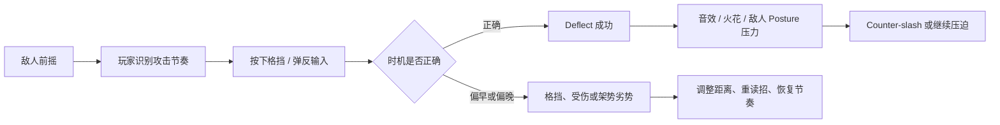

# 拆解_Sekiro

> 作品集用途：作为《Dead Cells》动作 Roguelike 拆解的战斗专项补充，展示对弹反手感、敌人读招、反馈与惩罚的分析能力，并为 [[DESIGN_玩家行为系统]]、[[策划案_玩家行为系统]]、[[策划案_锈犬]] 提供外部参考。

## 1. 拆解目标

本文只分析《Sekiro: Shadows Die Twice》的弹反体验如何成立。重点不是完整拆解地图、忍具、叙事或成长系统，而是研究一次成功弹反从敌人前摇到玩家反击之间的体验链路。

本文关注：

- 敌人攻击如何让玩家读招。
- 玩家输入如何转化为弹反结果。
- 成功弹反如何给予反馈和反击机会。
- 失败如何产生压力和学习动力。
- 这些结构如何转化为 Reforge 的弹反、受击硬直和敌人可弹反信号。

## 2. 事实来源

- [Sekiro: Shadows Die Twice Game Mechanics - Activision Support](https://support.activision.com/fi/sekiro/articles/sekiro-shadows-die-twice-game-mechanics)：用于核对攻击、Deflection、Posture、Counter-slash 和 Deathblow 的官方说明。
- [Deflection - Sekiro Shadows Die Twice Wiki](https://sekiroshadowsdietwice.wiki.fextralife.com/Deflection)：用于补充 Deflection 的社区资料。该页面访问稳定性一般，仅作辅助。
- [Posture - Sekiro Shadows Die Twice Wiki](https://sekiroshadowsdietwice.wiki.fextralife.com/Posture)：用于补充 Posture 的社区资料。该页面访问稳定性一般，仅作辅助。
- [Perilous Attacks - Sekiro Shadows Die Twice Wiki](https://sekiroshadowsdietwice.wiki.fextralife.com/Perilous%2BAttacks)：用于补充危险攻击的分类资料。该页面为社区资料，后续若写入正式策划依据，需要再用游戏内截图或实机观察校准。

## 3. 核心体验链路

弹反的乐趣来自“把敌人的攻击转化为自己的进攻机会”。玩家不是等待敌人攻击结束，而是在敌人攻击抵达的一瞬间接管节奏。

## 4. 为什么弹反能成为核心乐趣

### 4.1 输入短，但信息密度高

弹反输入本身很简单，玩家按下防御键即可尝试。但这个输入之前包含多层判断：

- 敌人是否已经进入攻击前摇。
- 这次攻击是单段、连段、延迟还是危险攻击。
- 现在应该弹反、闪避、跳跃、反击，还是拉开距离。
- 自己的 Posture 与生命是否允许继续承压。

所以弹反不是单纯反应速度测试，而是“识别、等待、输入、反馈”的连续判断。

### 4.2 成功反馈同时奖励手感与资源

官方说明中，成功 Deflect 可以保护玩家、伤害敌人 Posture，并创造 Counter-slash 机会。它同时满足三层奖励：

- 手感奖励：清脆音效、火花、命中停顿让玩家确认时机正确。
- 战斗奖励：敌人 Posture 受到压力，玩家获得反击窗口。
- 心理奖励：玩家感到自己读懂了敌人节奏。

### 4.3 失败压力推动学习

失败不只扣血，也会让玩家进入更不利的节奏。偏早可能变成普通格挡，偏晚可能受伤，连续失误会让玩家更难稳定攻防。

这种压力让玩家回头观察敌人动作，而不是只抱怨数值不够。优秀的弹反敌人需要让玩家相信：这次失败来自读招或节奏错误，下次可以改进。

## 5. 敌人如何教玩家弹反

### 5.1 前摇要清楚

弹反玩法对敌人动画要求很高。敌人的攻击前摇需要让玩家捕捉到至少一个稳定信号：

- 武器抬起方向。
- 身体重心变化。
- 冲刺或停顿节奏。
- 攻击前音效或特效。

如果前摇不可读，弹反会从技巧变成猜测。

### 5.2 连段要有节奏

《Sekiro》的许多敌人会通过连段让玩家进入攻防节奏。连段的价值在于：第一次可能靠反应，后续需要玩家进入节拍。

对 Reforge 来说，P0 锈犬不需要复杂连段，但铁甲扑击要有清楚前摇和可学习节奏。玩家第一次可能被扑中，第二次应能看出“蓄力结束后就是可弹反窗口”。

### 5.3 危险攻击提供分类判断

危险攻击会把玩家从单一弹反判断中拉出来，要求玩家识别不同应对方式。社区资料通常将其分为突刺、横扫、抓取、雷电等类型。

Reforge P0 暂不需要完整危险攻击系统，但可以借鉴“明确警示 + 不同应对”的思想。锈犬只需要一种可弹反扑击，后续敌人再逐步加入不可弹反攻击、范围攻击或延迟攻击。

## 6. 对 Reforge 的反推

### 6.1 玩家行为系统

Reforge 已有弹反、闪避、普攻、受击硬直和超频等行为。参考《Sekiro》后，弹反体验应保证以下规则：

- 弹反是主动接管节奏的动作，不只是防御按钮。
- 成功弹反应同时给战斗反馈和资源反馈。
- 失败弹反要有短惩罚，让玩家愿意学习时机。
- 闪避取消弹反可以成为 Reforge 的差异化操作，但需要避免完全覆盖普通弹反。
- 超频弹反应改变能量经济，不改变弹反的基础优先级。

### 6.2 敌人系统

锈犬作为 P0 第一个可弹反敌人，应承担教学任务：

- 蓄力前摇清楚。
- 扑击方向明确。
- 可弹反窗口与碰撞判定一致。
- 弹反成功后敌人进入短硬直。
- 弹反失败后玩家承受伤害或位置压力。

### 6.3 反馈系统

弹反成功至少需要三个反馈点：

- 视觉：火花、短闪、敌人硬直表现。
- 听觉：成功弹反音效触发点。
- 节奏：短暂停顿或轻微 HitStop。

P0 若不实现完整音频播放，也应保留事件触发点，方便 P0-7 统一接入音频。

## 7. 可转化为 Reforge 的设计输入

| 方向 | 玩家体验 | Reforge 落点 | 风险点 |
| --- | --- | --- | --- |
| 弹反成功回能 | 防守成功立即变成资源收益 | [[策划案_能量系统]] | 回能过高会让普攻回能失去意义 |
| 弹反后强化下一刀 | 成功防守后自然反击 | [[DESIGN_天赋系统]] / [[DATA_天赋池]] | 过强会压制闪避和普通连段 |
| 敌人可弹反预警 | 玩家知道这次攻击值得接 | [[策划案_锈犬]] | 预警过亮会降低读招成就感 |
| 弹反失败短硬直 | 失败可感知，但不立即崩盘 | [[策划案_玩家行为系统]] | 过长会打断战斗流畅度 |
| 连续弹反奖励 | 鼓励玩家进入攻防节拍 | P1 敌人与 Boss | P0 阶段开发成本偏高 |
| 危险攻击分类 | 强化不同应对选择 | P1/P2 敌人系统 | 过早加入会增加教学负担 |

## 8. 作品集展示角度

这篇拆解展示的能力点：

- 能把一个战斗手感拆成输入、反馈、惩罚和敌人读招。
- 能区分弹反的手感奖励、资源奖励和学习奖励。
- 能从成熟动作游戏中提取适合小型原型的实现边界。
- 能把外部拆解转化为 Reforge 的玩家行为、敌人和反馈需求。

## 9. 案例占位：苇名弦一郎攻防链路

苇名弦一郎适合作为后续案例对象，原因是他能集中展示《Sekiro》的攻防往返、连续弹反、反击窗口和危险攻击识别。当前文档尚未基于实机或录像逐秒校准，因此本节只作为案例占位，不写入具体招式顺序结论。

### 9.1 观察目标

- 敌人前摇是否足够清楚。
- 玩家何时从进攻切换到弹反。
- 成功弹反后是否出现明确反击窗口。
- 连续攻防是否形成可学习节奏。
- 危险攻击出现时，玩家如何从单一弹反切换到分类应对。

### 9.2 录像记录模板

| 时间点 | 敌人动作 | 玩家输入 | 反馈结果 | 设计观察 |
| --- | --- | --- | --- | --- |
| 0:00 |  |  |  |  |
| 0:03 |  |  |  |  |
| 0:06 |  |  |  |  |
| 0:09 |  |  |  |  |
| 0:12 |  |  |  |  |

### 9.3 写入正式案例前的校准要求

- 使用同一段清晰录像或实机录屏。
- 记录至少 10 到 20 秒连续攻防。
- 标注敌人前摇、玩家输入、成功反馈、失败反馈。
- 将观察结论落回 Reforge 的弹反窗口、敌人预警、反馈事件或天赋方向。

## 10. 待补内容

- 用一段具体敌人或 Boss 录像做逐秒拆解。
- 对比 Reforge 锈犬铁甲扑击，标注前摇、可弹反窗口、成功反馈、失败惩罚。
- 后续如时间允许，补一张“弹反体验链路”作品集信息图。
