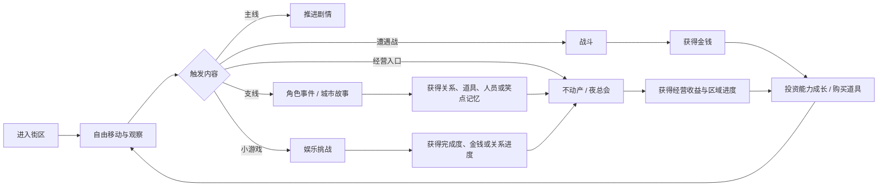
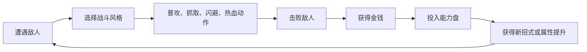
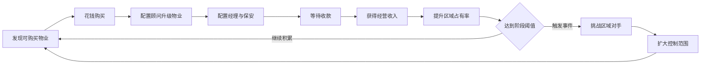
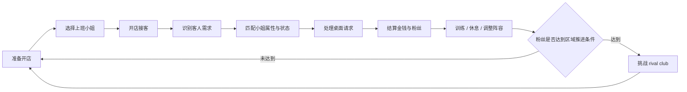

# 拆解_如龙0

> 本文关注《如龙0》如何用都市箱庭承载战斗成长、经济经营、支线内容和小游戏，并让这些系统共同服务 1988 年泡沫经济背景下的城市体验。

## 1. 拆解目标

本文分析《如龙0》如何在有限街区空间内，把主线叙事、遭遇战、小游戏、支线任务、战斗成长和模拟经营连接成高密度都市体验。

本文重点关注：

- 都市箱庭如何通过内容密度支撑探索。
- 金钱如何同时承担战斗奖励、成长消耗和时代氛围表达。
- 不动产经营和夜总会经营如何把街区内容转化为长期系统目标。
- 支线任务和小游戏如何强化城市生活感。
- 这些结构如何拆成规则说明和配置表。

## 2. 品类判断与拆解重心

《如龙0》可以归类为都市箱庭动作冒险。它的主体验由三部分共同组成：

- 动作战斗：街头遭遇战、Boss 战、战斗风格切换、金钱成长。
- 都市探索：神室町与苍天堀的街区移动、商店、小游戏、支线任务和 NPC 互动。
- 模拟经营：桐生的不动产经营、真岛的夜总会经营，把街区探索转化为长期经营目标。

从系统拆解角度看，《如龙0》的关键问题是“有限地图如何承载大量系统”。它的地图面积并不大，但内容入口密度高，且多数系统都能回到金钱、能力成长、区域控制或角色关系。

## 3. Core Loop

这套循环的关键在于：玩家在街区里做的事情虽然类型不同，但最终会汇入几个稳定结果。

- 金钱：战斗、经营和部分小游戏产出，用于能力升级、购买物品和继续经营投入。
- 完成度：小游戏、餐饮、支线和挑战提供长期收集目标。
- 关系与人员：支线和城市互动会解锁经营人员、店铺合作或特殊奖励。
- 街区控制：经营系统把城市空间转化为可争夺的进度条。

## 4. 系统总览

| 系统 | 玩家行为 | 主要产出 | 主要消耗 | 设计作用 |
|------|----------|----------|----------|----------|
| 街头战斗 | 遭遇敌人、切换风格、使用热血动作 | 金钱、战斗熟练度、爽快反馈 | 血量、道具、玩家操作成本 | 提供高频动作反馈，并持续产出成长资源 |
| 能力成长 | 在能力盘投入金钱 | 新招式、属性提升、战斗选择 | 大量金钱 | 把战斗收益转化为长期动作深度 |
| 不动产经营 | 购买店铺、配置人员、收款、区域对抗 | 大额金钱、区域占有率、隐藏风格进度 | 投资资金、等待时间、人员配置 | 把神室町街区变成经济系统地图 |
| 夜总会经营 | 配置小姐、开店接客、训练、区域竞争 | 金钱、粉丝、区域进度、人员成长 | 小姐体力、玩家分配注意力、准备成本 | 用轻量经营玩法支撑苍天堀的长期目标 |
| 支线任务 | 发现 NPC、完成事件、做选择或小游戏挑战 | 人员、道具、关系、完成度、城市记忆 | 时间、小游戏熟练度、少量资源 | 丰富城市生活感，并为经营系统供给人员和关系 |
| 小游戏 | 参与卡拉 OK、迪斯科、街机、赛车等玩法 | 完成度、金钱、关系或支线推进 | 玩家学习成本、时间 | 提供节奏变化，增强街区娱乐密度 |

## 5. 都市箱庭：小地图的高密度内容组织

《如龙0》的街区空间并不依赖大尺度探索。它的体验重点是“短距离内连续遇到内容”。

玩家在街上移动时，会不断遇到不同强度的内容入口：

- 强目标：主线地点、经营点、关键支线。
- 中目标：商店、餐饮、小游戏、训练点。
- 弱目标：街头敌人、对话 NPC、可购买物业、收集项。

这种结构让玩家在一次街区移动中频繁做小决策：

- 现在推进主线，还是先处理旁边的支线。
- 先把钱投入能力成长，还是投入经营系统。
- 遇到街头敌人时，是快速解决拿钱，还是绕开节省时间。
- 看到小游戏入口时，是试一次，还是留到后续补完成度。

街区密度的价值在于控制玩家的注意力。玩家很少长时间空走，城市始终在提供可触发内容。主线负责拉动方向，支线和小游戏负责填充生活感，经营系统负责把街区变成长期目标。

## 6. 战斗、金钱与成长

《如龙0》把金钱放在战斗成长的核心位置。在这个“金钱即力量”的世界里，玩家需要投资自己来解锁新能力。

战斗循环可以拆成：

桐生和真岛各自拥有多种战斗风格：

- 桐生：Brawler、Rush、Beast，分别偏向均衡格斗、高速连打和重型破坏。
- 真岛：Thug、Breaker、Slugger，分别偏向匕首般的快节奏攻击、舞蹈式群体压制和球棒武器感。

多风格的价值在于让战斗同时依靠数值成长和动作选择。玩家会根据敌人数量、距离、武器、场景道具和个人习惯切换打法。金钱升级进一步扩展每个风格的动作深度，让玩家的经营收益和街头战斗回到同一条成长线上。

这一点具有清晰的系统参考价值：同一种资源可以承担多重功能。

- 作为奖励：战斗后立即给玩家反馈。
- 作为消耗：能力升级、道具购买、经营投资都需要金钱。
- 作为主题表达：1988 年泡沫经济背景下，金钱成为时代气质的一部分。

## 7. 经营系统拆解

### 7.1 不动产经营：把街区变成区域控制

桐生的不动产经营围绕“区域占有率”展开。玩家通过购买店铺、投资升级、配置顾问、经理和保安，与五大富豪争夺神室町不同区域。

核心循环：

这个系统的设计价值在于把城市地图从“可逛空间”变成“可经营空间”。玩家走在神室町时，街边店铺可以从背景资产变成未来的资产、收入来源或区域竞争节点。

可拆出的配置字段：

| 字段 | 类型 | 用途 |
|------|------|------|
| property_id | string | 物业唯一 id |
| area_id | string | 所属区域 |
| name_key | localization_key | 物业显示名称 |
| purchase_cost | int | 购买价格 |
| base_revenue | int | 基础收益 |
| upgrade_level_max | int | 最大升级等级 |
| advisor_category | enum | 顾问适配类型 |
| control_gain | float | 对区域占有率的贡献 |
| unlock_condition | string | 解锁条件 |
| source_type | enum | 购买、友情、剧情奖励 |

街边店铺通过这些字段转化为可维护的系统数据。

### 7.2 夜总会经营：把人员配置做成即时调度

真岛的夜总会经营围绕 Club Sunshine 展开。玩家需要招募小姐、配置上班阵容、根据客人偏好安排接待，并通过经营夜晚积累金钱和粉丝。

核心循环：

夜总会经营和不动产经营的区别在于：不动产偏向长期投资和等待收益，夜总会偏向短时间内的实时分配。玩家需要在有限桌位、有限人员、小姐体力和客人偏好之间做选择。

可拆出的配置字段：

| 字段 | 类型 | 用途 |
|------|------|------|
| hostess_id | string | 小姐唯一 id |
| rank | enum | bronze / silver / gold / platinum |
| talk | int | Talk 属性 |
| party | int | Party 属性 |
| love | int | Love 属性 |
| skill | int | Skill 属性 |
| trait_sexy | enum | 外观偏好适配 |
| trait_beauty | enum | 外观偏好适配 |
| trait_cute | enum | 外观偏好适配 |
| trait_funny | enum | 外观偏好适配 |
| hp_max | int | 体力上限 |
| mood_rule | string | 心情变化规则 |
| unlock_source | enum | 初始、支线、街区招募、竞争胜利、CP 兑换 |

角色属性、客人需求、区域进度、体力和奖励结算都可以拆成可维护字段。

## 8. 支线与小游戏：城市记忆的生产方式

《如龙0》的主线是黑道犯罪叙事，支线常以荒诞、喜剧和人情味展开。两者共同塑造城市气质。

支线任务承担三类功能：

- 叙事调味：在严肃主线之外提供轻喜剧、人情故事和时代记忆。
- 系统连接：部分支线会解锁经营人员、友情物业、小游戏进度或特殊奖励。
- 街区塑形：NPC 同时承担任务入口、空间记忆和城市性格表达，让某个街角、店铺或小游戏入口变得有记忆点。

小游戏承担两类功能：

- 节奏切换：把玩家从战斗和剧情中暂时抽离，提供轻量娱乐。
- 完成度目标：给长期玩家提供补完、挑战和收藏动力。

这类内容让城市获得“可逛性”。玩家会同时记住地图结构、具体店铺、NPC、荒诞事件和小游戏经历。

## 9. 可配置内容拆分

《如龙0》的经营系统可以继续拆成多张配置表。不同表之间通过 `area_id`、`property_id`、`hostess_id`、`customer_type` 等字段建立关系。

| 配置表 | 主要字段 | 关联对象 | 作用 |
|--------|----------|----------|------|
| area_config | area_id、area_name_key、rival_id、progress_threshold | 区域、对手、事件 | 控制经营区域分层和阶段推进 |
| property_config | property_id、area_id、purchase_cost、base_revenue、control_gain | 物业、区域 | 控制不动产购买、收益和占有率 |
| staff_config | staff_id、role、rank、salary_rule、bonus_effect | 顾问、经理、保安 | 控制人员配置和经营加成 |
| hostess_config | hostess_id、rank、talk、party、love、skill、hp_max | 夜总会小姐 | 控制人员能力、体力和匹配效率 |
| customer_config | customer_type、budget、preferred_trait、patience | 客人 | 控制接客难度和收益结构 |
| rival_event_config | rival_id、area_id、trigger_progress、reward | 对手事件 | 控制区域竞争节奏和阶段奖励 |

这些配置表共同把街区、人员、客人、对手和经营收益连接起来。玩家看到的是一条城市经营线，底层则是区域、资源、人员和事件的结构化组合。

## 10. 设计启示

### 10.1 小地图可以靠内容密度成立

都市类游戏不一定依赖大地图。只要街区中存在足够多的可触发内容、可记忆角色和可回访目标，小空间也能形成强烈的生活感。

设计原则：

- 主线给方向。
- 支线给记忆。
- 小游戏给节奏变化。
- 经营系统给回访理由。
- 战斗给高频反馈和资源产出。

### 10.2 核心资源可以服务主题表达

《如龙0》的金钱系统和泡沫经济背景高度统一。金钱既是奖励、消耗、成长材料，也是时代氛围。

设计原则：

- 当核心资源与世界观主题一致时，玩家的重复行为会更自然。
- 资源用途越多，越需要控制产出节奏和消耗层级。
- 高价值资源可以同时连接战斗、成长、经营和探索。

### 10.3 支线可以成为系统入口

支线同时承担叙事内容、人员入口、物业入口、关系入口和小游戏入口。这样能让内容生产和系统成长互相支撑。

设计原则：

- 支线奖励应尽量连接长期系统。
- 经营人员、特殊店铺、友情关系都适合作为支线奖励。
- 城市 NPC 的记忆点可以转化为可用资源。
